# Smart Forest Fire Prevention System - Complete Architecture Diagram

## Complete System Architecture (All-in-One View)

```mermaid
graph TB
    %% ============ HARDWARE LAYER ============
    subgraph HARDWARE["🔧 IoT Hardware Layer"]
        direction TB
        ESP32["ESP32<br/>Microcontroller<br/>WiFi/BLE"]
        DHT22["DHT22<br/>Temperature<br/>Humidity"]
        MQ2["MQ-2<br/>Smoke<br/>Sensor"]
        RAIN_S["Rain<br/>Sensor"]
        
        DHT22 -.->|I2C| ESP32
        MQ2 -.->|Analog| ESP32
        RAIN_S -.->|Digital| ESP32
    end
    
    %% ============ DATA INGESTION ============
    subgraph INGESTION["📡 Data Ingestion Layer"]
        SERIAL["Serial Port<br/>/dev/ttyUSB0<br/>115200 baud"]
        INGEST["sensor_ingestion.py<br/>Parser & Validator"]
        WS_MGR["WebSocket Manager<br/>ConnectionManager"]
    end
    
    %% ============ BACKEND CORE ============
    subgraph BACKEND["🚀 Backend Core - FastAPI (Port 8000)"]
        direction TB
        
        subgraph AUTH_MODULE["🔐 Authentication"]
            AUTH_SVC["auth.py<br/>JWT Handler"]
            USERS_DB[("Users<br/>Collection")]
        end
        
        subgraph DB_MODULE["💾 Database Layer"]
            DB_MGR["database.py<br/>Motor AsyncIO"]
            MONGO[("MongoDB Atlas<br/>Cloud Database")]
            
            COLLECTIONS["Collections:<br/>• sensor_data<br/>• users<br/>• alerts<br/>• sprinkler_logs<br/>• predictions<br/>• weather_cache"]
        end
        
        subgraph ROUTES["🛣️ API Routes"]
            R_AUTH["/auth/*<br/>Login/Register"]
            R_SENSOR["/sensors/*<br/>Latest/History"]
            R_DASH["/dashboard/*<br/>Stats/Charts"]
            R_ALERTS["/alerts/*<br/>Manage Alerts"]
            R_SPRINKLER["/sprinkler/*<br/>Control System"]
            R_ML["/api/predictions/*<br/>Fire Risk ML"]
            R_WEATHER["/api/weather/*<br/>External Data"]
            R_ZONES["/api/zones/*<br/>Multi-Zone"]
            R_ANALYTICS["/api/analytics/*<br/>Insights"]
        end
    end
    
    %% ============ INTELLIGENCE LAYER ============
    subgraph INTELLIGENCE["🧠 Intelligence & Analytics Layer"]
        direction TB
        
        subgraph ML_MODULE["🤖 Machine Learning"]
            ML_PREDICTOR["ml_predictor.py<br/>Fire Risk Prediction"]
            RF["Random Forest<br/>Regressor"]
            GB["Gradient Boosting<br/>Classifier"]
            SCALER["Standard Scaler<br/>Normalization"]
            ML_MODEL[("fwi_model.pkl<br/>Trained Model")]
            
            ML_PREDICTOR --> RF
            ML_PREDICTOR --> GB
            ML_PREDICTOR --> SCALER
            RF --> ML_MODEL
            GB --> ML_MODEL
        end
        
        subgraph AI_MODULE["🎯 AI Agent"]
            AI_AGENT["ai_agent.py<br/>Risk Analysis"]
            GROQ_API["Groq AI API<br/>Llama 3.1 70B"]
            AI_AGENT --> GROQ_API
        end
        
        subgraph EXT_MODULE["🌍 External Data"]
            EXT_INT["external_integrator.py<br/>API Manager"]
            OWM["OpenWeatherMap<br/>Weather Data"]
            NASA["NASA FIRMS<br/>Fire Hotspots"]
            WEATHER_CACHE[("Weather<br/>Cache<br/>10min TTL")]
            
            EXT_INT --> OWM
            EXT_INT --> NASA
            EXT_INT --> WEATHER_CACHE
        end
        
        subgraph ANALYTICS_MODULE["📊 Analytics"]
            ANALYTICS_ENG["analytics_engine.py<br/>Data Analysis"]
            PATTERNS["Pattern Detection"]
            TRENDS["Trend Analysis"]
            FORECASTING["Forecasting"]
            
            ANALYTICS_ENG --> PATTERNS
            ANALYTICS_ENG --> TRENDS
            ANALYTICS_ENG --> FORECASTING
        end
        
        subgraph ALERT_MODULE["🚨 Smart Alerts"]
            ALERT_SYS["smart_alerts.py<br/>Alert Engine"]
            PRIORITY["Priority Queue<br/>low/medium/high/critical"]
            NOTIFICATION["Notification<br/>System"]
            
            ALERT_SYS --> PRIORITY
            ALERT_SYS --> NOTIFICATION
        end
        
        subgraph ADVANCED["⚙️ Advanced Features"]
            MULTI_ZONE["multi_zone_manager.py<br/>Zone Monitoring"]
            SPRINKLER_CTRL["Sprinkler Control<br/>Auto/Manual"]
        end
    end
    
    %% ============ FRONTEND ============
    subgraph FRONTEND["🖥️ Frontend - Next.js (Port 3000)"]
        direction TB
        
        subgraph PAGES["📄 Pages (App Router)"]
            LOGIN_PAGE["Login Page<br/>/login"]
            DASH_PAGE["Dashboard<br/>/dashboard"]
        end
        
        subgraph COMPONENTS["🎨 React Components"]
            LIVE_DATA["LiveSensorData.tsx<br/>Real-time Display"]
            CHART_COMP["SensorChart.tsx<br/>Recharts Graphs"]
            HIST_DATA["HistoricalData.tsx<br/>Data Table"]
            ALERTS_PANEL["AlertsPanel.tsx<br/>Alert Management"]
            SPRINKLER_UI["SprinklerControl.tsx<br/>Manual Control"]
            AI_REC["AIRecommendations.tsx<br/>AI Insights"]
            WEATHER_UI["WeatherSatellite.tsx<br/>Weather & Hotspots"]
            ANALYTICS_UI["Analytics Charts<br/>Trends & Patterns"]
        end
        
        subgraph STATE["📦 State Management"]
            AUTH_STORE["authStore.ts<br/>Zustand Store"]
            LOCAL_STORAGE["localStorage<br/>Token & User"]
        end
        
        subgraph API_CLIENT["🔌 API Layer"]
            AXIOS_CLIENT["api.ts<br/>Axios Client"]
            WS_CLIENT["WebSocket Client<br/>Live Updates"]
        end
    end
    
    %% ============ USERS ============
    subgraph USERS["👥 User Roles"]
        ADMIN["👑 Admin<br/>Full Access"]
        OPERATOR["👨‍💼 Operator<br/>Control Systems"]
        VIEWER["👀 Viewer<br/>Read Only"]
    end
    
    %% ============ EXTERNAL SERVICES ============
    subgraph EXTERNAL["☁️ External Services"]
        MONGO_CLOUD["MongoDB Atlas<br/>Cloud Hosting"]
        GROQ_CLOUD["Groq API<br/>AI Inference"]
        WEATHER_API["OpenWeatherMap<br/>Delhi Weather"]
        FIRMS_API["NASA FIRMS<br/>Satellite Data"]
    end
    
    %% ============ CONNECTIONS - HARDWARE TO BACKEND ============
    ESP32 -->|Serial USB| SERIAL
    SERIAL --> INGEST
    
    %% ============ CONNECTIONS - INGESTION TO CORE ============
    INGEST -->|Parse & Store| DB_MGR
    INGEST -->|Real-time Broadcast| WS_MGR
    INGEST -->|Trigger Analysis| ML_PREDICTOR
    INGEST -->|AI Analysis Every 30s| AI_AGENT
    
    %% ============ CONNECTIONS - DATABASE ============
    DB_MGR --> MONGO
    MONGO --> COLLECTIONS
    AUTH_SVC --> USERS_DB
    
    %% ============ CONNECTIONS - ROUTES TO SERVICES ============
    R_AUTH --> AUTH_SVC
    R_SENSOR --> DB_MGR
    R_DASH --> DB_MGR
    R_DASH --> ML_PREDICTOR
    R_DASH --> ANALYTICS_ENG
    R_ALERTS --> ALERT_SYS
    R_SPRINKLER --> SPRINKLER_CTRL
    R_ML --> ML_PREDICTOR
    R_WEATHER --> EXT_INT
    R_ZONES --> MULTI_ZONE
    R_ANALYTICS --> ANALYTICS_ENG
    
    %% ============ CONNECTIONS - INTELLIGENCE ============
    ML_PREDICTOR -.->|Historical Data| DB_MGR
    AI_AGENT -.->|Current Readings| DB_MGR
    EXT_INT -.->|Weather Data| DB_MGR
    ANALYTICS_ENG -.->|Query Data| DB_MGR
    
    ALERT_SYS -.->|Store Alerts| DB_MGR
    ALERT_SYS -.->|Trigger| SPRINKLER_CTRL
    
    ML_PREDICTOR -.->|Risk Predictions| ALERT_SYS
    AI_AGENT -.->|AI Analysis| ALERT_SYS
    EXT_INT -.->|Weather Risk| ALERT_SYS
    
    %% ============ CONNECTIONS - EXTERNAL APIS ============
    DB_MGR --> MONGO_CLOUD
    AI_AGENT --> GROQ_CLOUD
    EXT_INT --> WEATHER_API
    EXT_INT --> FIRMS_API
    
    %% ============ CONNECTIONS - FRONTEND TO BACKEND ============
    AXIOS_CLIENT -->|HTTP/REST| ROUTES
    WS_CLIENT -->|WebSocket| WS_MGR
    
    LOGIN_PAGE --> AXIOS_CLIENT
    DASH_PAGE --> AXIOS_CLIENT
    DASH_PAGE --> WS_CLIENT
    
    LIVE_DATA --> WS_CLIENT
    CHART_COMP --> AXIOS_CLIENT
    HIST_DATA --> AXIOS_CLIENT
    ALERTS_PANEL --> AXIOS_CLIENT
    SPRINKLER_UI --> AXIOS_CLIENT
    AI_REC --> AXIOS_CLIENT
    WEATHER_UI --> AXIOS_CLIENT
    ANALYTICS_UI --> AXIOS_CLIENT
    
    AUTH_STORE --> LOCAL_STORAGE
    AXIOS_CLIENT -.->|JWT Token| AUTH_STORE
    
    %% ============ CONNECTIONS - USERS ============
    ADMIN --> LOGIN_PAGE
    OPERATOR --> LOGIN_PAGE
    VIEWER --> LOGIN_PAGE
    
    %% ============ STYLING ============
    classDef hardware fill:#ff6b6b,stroke:#c92a2a,color:#fff
    classDef ingestion fill:#fab005,stroke:#f08c00,color:#000
    classDef backend fill:#4dabf7,stroke:#1971c2,color:#fff
    classDef intelligence fill:#51cf66,stroke:#2f9e44,color:#fff
    classDef ml fill:#94d82d,stroke:#5c940d,color:#000
    classDef ai fill:#ffd43b,stroke:#fab005,color:#000
    classDef external fill:#a9e34b,stroke:#82c91e,color:#000
    classDef frontend fill:#da77f2,stroke:#9c36b5,color:#fff
    classDef database fill:#845ef7,stroke:#5f3dc4,color:#fff
    classDef users fill:#ff8787,stroke:#fa5252,color:#fff
    classDef cloud fill:#74c0fc,stroke:#339af0,color:#000
    
    class ESP32,DHT22,MQ2,RAIN_S hardware
    class SERIAL,INGEST,WS_MGR ingestion
    class R_AUTH,R_SENSOR,R_DASH,R_ALERTS,R_SPRINKLER,R_ML,R_WEATHER,R_ZONES,R_ANALYTICS backend
    class ML_PREDICTOR,RF,GB,SCALER,ML_MODEL ml
    class AI_AGENT,GROQ_API ai
    class EXT_INT,OWM,NASA,WEATHER_CACHE external
    class ANALYTICS_ENG,PATTERNS,TRENDS,FORECASTING,ALERT_SYS,PRIORITY,NOTIFICATION,MULTI_ZONE,SPRINKLER_CTRL intelligence
    class LOGIN_PAGE,DASH_PAGE,LIVE_DATA,CHART_COMP,HIST_DATA,ALERTS_PANEL,SPRINKLER_UI,AI_REC,WEATHER_UI,ANALYTICS_UI,AUTH_STORE,AXIOS_CLIENT,WS_CLIENT frontend
    class DB_MGR,MONGO,COLLECTIONS,USERS_DB database
    class ADMIN,OPERATOR,VIEWER users
    class MONGO_CLOUD,GROQ_CLOUD,WEATHER_API,FIRMS_API cloud
```

## Legend

### 🎨 Color Coding
- 🔴 **Red** - Hardware (ESP32, Sensors)
- 🟠 **Orange** - Data Ingestion (Serial, Parser)
- 🔵 **Blue** - Backend Core (FastAPI, Routes)
- 🟢 **Green** - Intelligence Layer (ML, AI, Analytics)
- 🟡 **Yellow** - AI Services (Groq)
- 🟣 **Purple** - Frontend (Next.js, React)
- 🟪 **Violet** - Database (MongoDB)
- 🔴 **Light Red** - Users
- ☁️ **Light Blue** - External Cloud Services

### 📊 Connection Types
- **Solid Lines (→)** - Direct data flow / API calls
- **Dotted Lines (-.->)** - Async operations / Background tasks

### 📍 Key Components

#### Hardware Layer
- ESP32 reads sensors every ~5 seconds
- Sends data via Serial USB connection

#### Ingestion Layer
- Parses serial data
- Stores in MongoDB
- Broadcasts via WebSocket
- Triggers ML & AI analysis

#### Backend Core
- FastAPI handles all HTTP requests
- JWT authentication for security
- Multiple route modules for different features
- MongoDB for persistent storage

#### Intelligence Layer
- **ML**: Random Forest + Gradient Boosting for predictions
- **AI**: Groq LLM for risk analysis & recommendations
- **External APIs**: Real weather data from OpenWeatherMap
- **Analytics**: Pattern detection, trends, forecasting
- **Alerts**: Smart notification system with priority queue
- **Advanced**: Multi-zone monitoring, auto sprinkler control

#### Frontend
- Next.js 14 with App Router
- Real-time updates via WebSocket
- Recharts for data visualization
- Zustand for state management
- Tailwind CSS for styling

#### External Services
- MongoDB Atlas (cloud database)
- Groq API (AI inference)
- OpenWeatherMap (weather data for Delhi)
- NASA FIRMS (satellite fire detection)

---

## 📈 Data Flow Summary

1. **ESP32** → reads sensors → sends via Serial
2. **Ingestion** → parses → stores in MongoDB + broadcasts WebSocket
3. **ML Model** → analyzes patterns → predicts fire risk 1-24 hours ahead
4. **AI Agent** → analyzes current state → generates recommendations
5. **External APIs** → fetch weather + satellite data
6. **Alert System** → evaluates all inputs → triggers alerts/sprinklers
7. **Frontend** → receives real-time updates → displays dashboards
8. **Users** → authenticate → interact with system → control sprinklers

## 🚀 Key Features

✅ Real-time sensor monitoring (WebSocket)  
✅ ML-based fire risk predictions  
✅ AI-powered recommendations (Groq LLM)  
✅ Weather integration (Delhi region)  
✅ NASA satellite fire detection  
✅ Smart alert system  
✅ Automatic sprinkler control  
✅ Multi-zone monitoring  
✅ Historical data analytics  
✅ Role-based access control  
✅ Responsive web dashboard  

---

*Complete System Architecture - November 2025*
