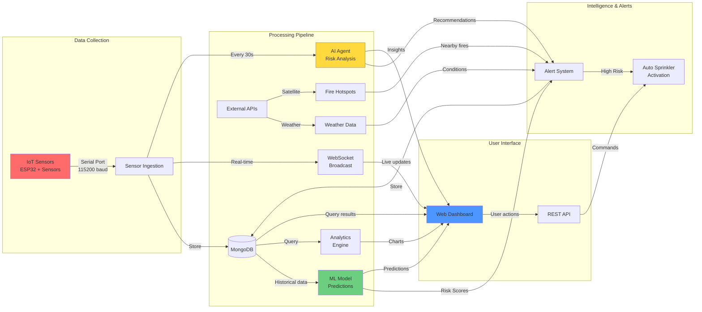
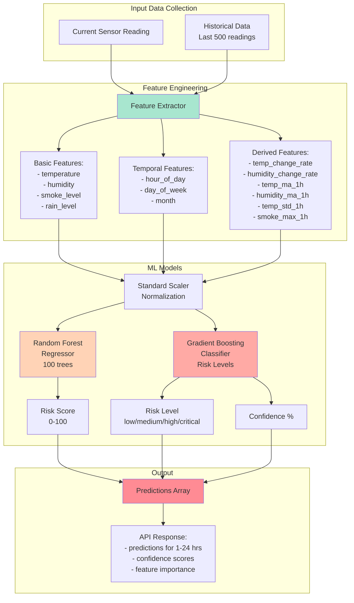
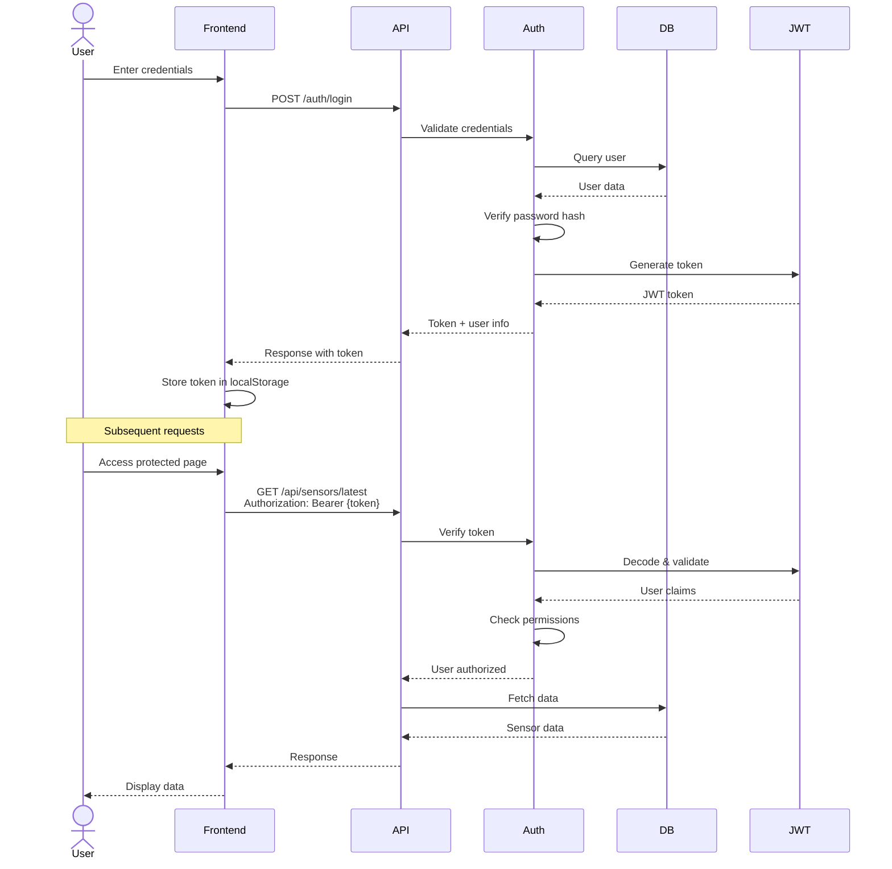
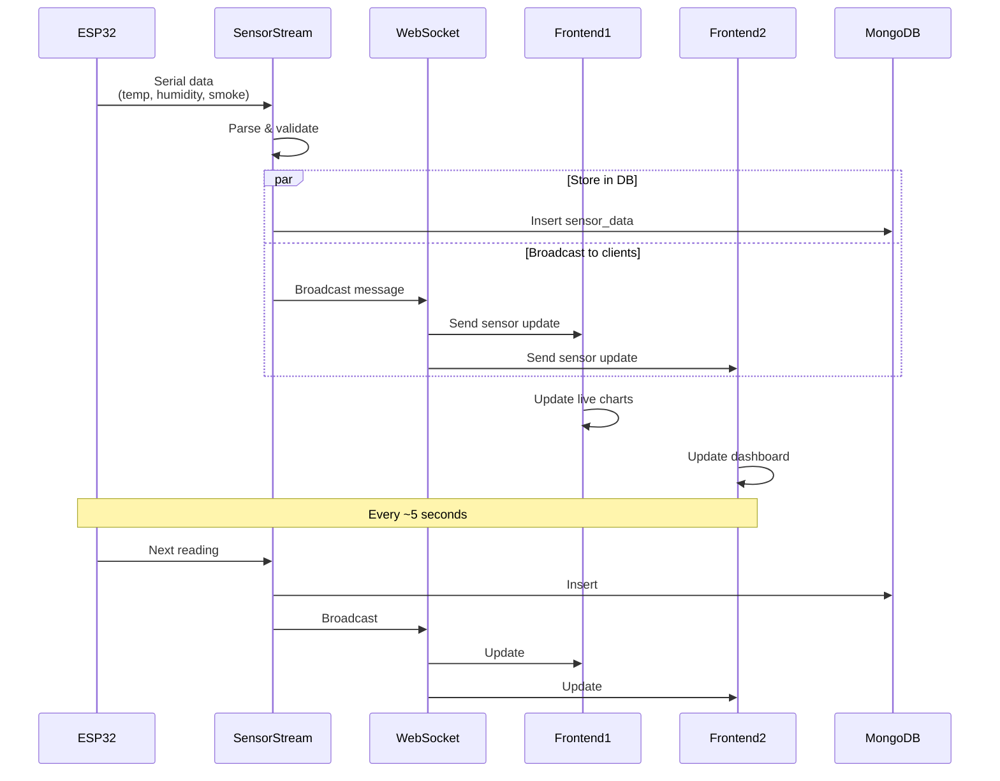
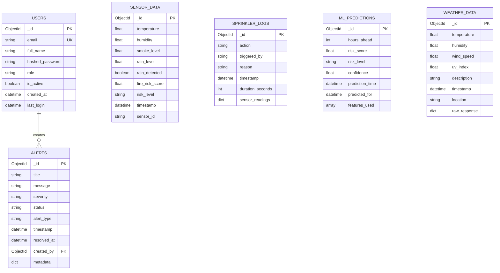
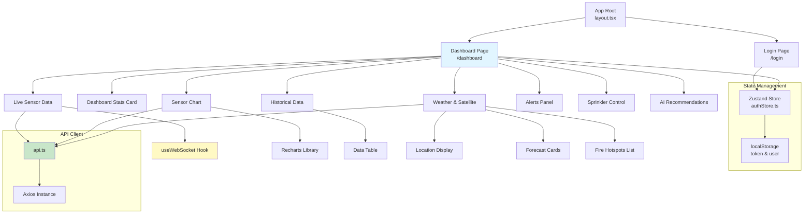
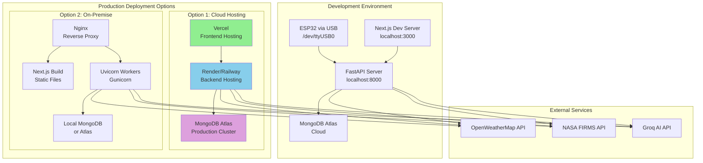

# Smart Forest Fire Prevention System - Architecture Diagrams

## 1. System Architecture Overview

```mermaid
graph TB
    subgraph "IoT Hardware Layer"
        ESP32[ESP32 Microcontroller]
        DHT22[DHT22<br/>Temp & Humidity]
        MQ2[MQ-2<br/>Smoke Sensor]
        RAIN[Rain Sensor]
        ESP32 --> DHT22
        ESP32 --> MQ2
        ESP32 --> RAIN
    end

    subgraph "Backend Services (FastAPI + Python)"
        API[FastAPI Server<br/>Port 8000]
        
        subgraph "Core Modules"
            SI[Sensor Ingestion<br/>Serial/WebSocket]
            DB[Database Manager<br/>MongoDB]
            AUTH[Auth Service<br/>JWT]
        end
        
        subgraph "Intelligence Layer"
            ML[ML Predictor<br/>RandomForest]
            AI[AI Agent<br/>Groq LLM]
            EXT[External Integrator<br/>Weather APIs]
            ANALYTICS[Analytics Engine]
            ALERTS[Smart Alerts]
        end
        
        subgraph "Advanced Features"
            MULTI[Multi-Zone Manager]
            SPRINKLER[Sprinkler Control]
        end
    end

    subgraph "Database Layer"
        MONGO[(MongoDB Atlas<br/>Cloud Database)]
        MONGO_COLLECTIONS[Collections:<br/>- sensor_data<br/>- users<br/>- alerts<br/>- sprinkler_logs]
    end

    subgraph "External APIs"
        WEATHER[OpenWeatherMap API<br/>Real-time Weather]
        FIRMS[NASA FIRMS<br/>Fire Hotspots]
        GROQ[Groq AI<br/>LLM Analysis]
    end

    subgraph "Frontend (Next.js + React)"
        WEB[Web Dashboard<br/>Port 3000]
        
        subgraph "Pages"
            LOGIN[Login/Register]
            DASH[Main Dashboard]
            CHARTS[Charts & Analytics]
            WEATHER_UI[Weather & Satellite]
        end
        
        subgraph "Real-time Updates"
            WS[WebSocket Client]
        end
    end

    subgraph "Users"
        ADMIN[Admin User]
        OPERATOR[Operator]
        VIEWER[Viewer]
    end

    %% Hardware to Backend
    ESP32 -->|Serial USB| SI
    
    %% Core connections
    SI --> API
    SI -->|Store readings| DB
    SI -->|Broadcast| WS
    DB --> MONGO
    AUTH --> MONGO
    
    %% Intelligence connections
    SI -->|Trigger analysis| ML
    SI -->|Real-time data| AI
    ML -->|Predictions| API
    AI -->|Recommendations| API
    EXT -->|Weather data| API
    ANALYTICS -->|Insights| API
    ALERTS -->|Notifications| API
    
    %% External API calls
    EXT --> WEATHER
    EXT --> FIRMS
    AI --> GROQ
    
    %% Advanced features
    MULTI --> API
    SPRINKLER --> API
    
    %% Frontend connections
    WEB -->|HTTP/REST| API
    WEB -->|WebSocket| SI
    API --> WEB
    
    %% User access
    ADMIN --> LOGIN
    OPERATOR --> LOGIN
    VIEWER --> LOGIN
    LOGIN --> DASH
    DASH --> CHARTS
    DASH --> WEATHER_UI
    
    style ESP32 fill:#ff9999
    style API fill:#99ccff
    style ML fill:#99ff99
    style AI fill:#ffcc99
    style MONGO fill:#cc99ff
    style WEB fill:#99ffcc
```



## 2. Data Flow Diagram



## 3. ML Prediction Pipeline



## 4. Authentication & Authorization Flow



## 5. Real-time WebSocket Communication



## 6. Database Schema



## 7. Component Interaction Matrix

```mermaid
graph LR
    subgraph "Routes/Endpoints"
        R_AUTH[/auth/*]
        R_SENSORS[/sensors/*]
        R_DASHBOARD[/dashboard/*]
        R_ALERTS[/alerts/*]
        R_SPRINKLER[/sprinkler/*]
        R_ML[/api/predictions/*]
        R_WEATHER[/api/weather/*]
        R_ZONES[/api/zones/*]
    end
    
    subgraph "Services"
        S_AUTH[Auth Service]
        S_DB[Database]
        S_ML[ML Predictor]
        S_AI[AI Agent]
        S_EXT[External APIs]
        S_ALERTS[Alert System]
        S_MULTI[Multi-Zone]
    end
    
    R_AUTH --> S_AUTH
    R_AUTH --> S_DB
    
    R_SENSORS --> S_DB
    R_SENSORS --> S_AUTH
    
    R_DASHBOARD --> S_DB
    R_DASHBOARD --> S_AUTH
    R_DASHBOARD --> S_ML
    
    R_ALERTS --> S_ALERTS
    R_ALERTS --> S_DB
    R_ALERTS --> S_AUTH
    
    R_SPRINKLER --> S_DB
    R_SPRINKLER --> S_AUTH
    R_SPRINKLER --> S_ALERTS
    
    R_ML --> S_ML
    R_ML --> S_DB
    R_ML --> S_AUTH
    
    R_WEATHER --> S_EXT
    R_WEATHER --> S_AUTH
    
    R_ZONES --> S_MULTI
    R_ZONES --> S_AUTH
    R_ZONES --> S_DB
    
    style S_ML fill:#90ee90
    style S_AI fill:#ffd700
    style S_EXT fill:#87ceeb
```

## 8. Frontend Component Hierarchy



## 9. Deployment Architecture



## 10. File Structure Tree

```
INNOTECH-2025/
├── backend/                    # Python FastAPI Backend
│   ├── main.py                # FastAPI app entry point
│   ├── config.py              # Settings & environment config
│   ├── database.py            # MongoDB connection manager
│   ├── models.py              # Pydantic data models
│   ├── auth.py                # JWT authentication
│   │
│   ├── routes_*.py            # API route modules
│   │   ├── routes_auth.py     # Login, register, user management
│   │   ├── routes_sensors.py  # Sensor data endpoints
│   │   ├── routes_dashboard.py # Dashboard stats & charts
│   │   ├── routes_alerts.py   # Alert management
│   │   ├── routes_sprinkler.py # Sprinkler control
│   │   ├── routes_advanced.py # ML, weather, zones
│   │   └── routes_export.py   # Data export
│   │
│   ├── sensor_ingestion.py   # Serial port data collection
│   ├── ml_predictor.py        # Machine learning models
│   ├── ai_agent.py            # Groq AI integration
│   ├── external_integrator.py # Weather & satellite APIs
│   ├── analytics_engine.py    # Data analytics
│   ├── smart_alerts.py        # Alert generation system
│   ├── multi_zone_manager.py  # Multi-zone monitoring
│   │
│   ├── models/                # Saved ML models
│   │   └── fwi_model.pkl
│   │
│   ├── requirements.txt       # Python dependencies
│   ├── .env                   # Environment variables
│   └── .env.example          # Example configuration
│
├── frontend/                  # Next.js React Frontend
│   ├── src/
│   │   ├── app/              # Next.js 14 App Router
│   │   │   ├── layout.tsx    # Root layout
│   │   │   ├── page.tsx      # Home/landing page
│   │   │   ├── login/        # Login page
│   │   │   └── dashboard/    # Main dashboard
│   │   │
│   │   ├── components/       # React components
│   │   │   ├── LiveSensorData.tsx
│   │   │   ├── SensorChart.tsx
│   │   │   ├── HistoricalData.tsx
│   │   │   ├── AlertsPanel.tsx
│   │   │   ├── SprinklerControl.tsx
│   │   │   ├── AIRecommendationsSidebar.tsx
│   │   │   ├── WeatherSatellite.tsx
│   │   │   └── ...
│   │   │
│   │   ├── lib/              # Utilities
│   │   │   ├── api.ts        # API client (Axios)
│   │   │   └── utils.ts      # Helper functions
│   │   │
│   │   └── store/            # State management
│   │       └── authStore.ts  # Zustand auth store
│   │
│   ├── package.json          # NPM dependencies
│   ├── tailwind.config.js    # Tailwind CSS config
│   └── next.config.js        # Next.js configuration
│
├── docs/                      # Documentation
│   ├── API_DOCS.md
│   ├── ARCHITECTURE.md
│   ├── QUICKSTART.md
│   └── WEATHER_INTEGRATION_COMPLETE.md
│
└── README.md                 # Project overview
```

## Technology Stack Summary

### Backend
- **Framework**: FastAPI (Python 3.8+)
- **Database**: MongoDB (Motor async driver)
- **ML**: scikit-learn, numpy, pandas
- **AI**: Groq API (Llama 3.1)
- **External APIs**: OpenWeatherMap, NASA FIRMS
- **Real-time**: WebSocket, asyncio
- **Auth**: JWT (python-jose, passlib)

### Frontend
- **Framework**: Next.js 14 (React 18)
- **Language**: TypeScript
- **Styling**: Tailwind CSS
- **Charts**: Recharts
- **HTTP**: Axios
- **State**: Zustand
- **Icons**: Lucide React

### Hardware
- **Microcontroller**: ESP32
- **Sensors**: DHT22, MQ-2, Rain Sensor
- **Communication**: Serial (USB)

### Infrastructure
- **Database**: MongoDB Atlas (Cloud)
- **AI**: Groq Cloud API
- **Weather**: OpenWeatherMap API
- **Version Control**: Git + GitHub

---

*Generated: November 2025*
*Project: Smart Forest Fire Prevention System*
