# Smart Forest Fire Prevention System - Sequence Diagrams (Mermaid)

## 1. Complete Data Flow - From Sensor to Dashboard

```mermaid
sequenceDiagram
    participant ESP32
    participant Serial as Serial Port
    participant Ingest as Sensor Ingestion
    participant DB as MongoDB
    participant ML as ML Predictor
    participant AI as AI Agent
    participant Alert as Alert System
    participant Sprinkler
    participant WS as WebSocket
    participant Frontend
    participant User
    
    Note over ESP32: Every 5 seconds
    ESP32->>Serial: Temperature: 32°C<br/>Humidity: 45%<br/>Smoke: 120 ppm<br/>Rain: No
    Serial->>Ingest: Parse serial data
    Ingest->>Ingest: Validate & calculate risk
    
    par Store in Database
        Ingest->>DB: Insert sensor_data
        DB-->>Ingest: OK
    and Broadcast Real-time
        Ingest->>WS: Broadcast to clients
        WS->>Frontend: Send sensor update
        Frontend->>Frontend: Update live charts
        Frontend->>User: Display new reading
    and Trigger ML Analysis
        Ingest->>ML: Analyze patterns
        ML->>DB: Query historical data
        DB-->>ML: Last 500 readings
        ML->>ML: Feature extraction<br/>Random Forest prediction
        ML-->>Ingest: Risk: 75% (High)
    and AI Analysis (Every 30s)
        Ingest->>AI: Current + historical data
        AI->>DB: Query context
        DB-->>AI: Recent patterns
        AI->>AI: Groq LLM analysis
        AI-->>Ingest: Recommendations
    end
    
    alt High Risk Detected (>70%)
        ML->>Alert: High risk alert
        Alert->>Alert: Evaluate priority<br/>Check thresholds
        Alert->>DB: Store alert
        Alert->>WS: Broadcast alert
        WS->>Frontend: Alert notification
        Frontend->>User: 🚨 High Risk Warning!
        Alert->>Sprinkler: Auto-activate command
        Sprinkler->>DB: Log activation
        Sprinkler-->>Alert: Activated
        Alert->>WS: Sprinkler status
        WS->>Frontend: Update sprinkler UI
    else Normal Risk
        ML->>DB: Store prediction
    end
```

## 2. User Authentication Flow

## 3. Protected API Request with JWT

## 4. ML Model Training Flow

```mermaid
sequenceDiagram
    actor Admin
    participant Frontend
    participant API as FastAPI
    participant Auth as Auth Service
    participant DB as MongoDB
    participant ML as ML Predictor
    participant Model as Model Files
    
    Admin->>Frontend: Click "Train ML Model"
    Frontend->>API: POST /api/ml/train<br/>Authorization: Bearer token
    
    API->>Auth: Verify admin role
    Auth->>Auth: Check role == "admin"
    
    alt Is Admin
        Auth-->>API: ✅ Authorized
        
        API->>DB: Query sensor_data<br/>Sort DESC<br/>Limit 10,000
        DB-->>API: Historical readings
        
        alt Sufficient Data (>100 samples)
            API->>ML: train(sensor_history, risk_scores)
            
            ML->>ML: Extract 13 features:<br/>- Basic: temp, humidity, smoke<br/>- Temporal: hour, day, month<br/>- Derived: change rates, moving avg
            
            ML->>ML: StandardScaler normalization
            
            par Train Models
                ML->>ML: Random Forest Regressor<br/>100 trees, max_depth=15
            and
                ML->>ML: Gradient Boosting Classifier<br/>100 estimators
            end
            
            ML->>ML: Calculate feature importance
            ML->>Model: Save to models/fwi_model.pkl
            Model-->>ML: Saved
            
            ML-->>API: {<br/>  message: "Success",<br/>  samples: 10000,<br/>  features: [...]<br/>}
            API-->>Frontend: 200 OK
            Frontend->>Admin: ✅ Model trained successfully!<br/>10,000 samples used
            
        else Insufficient Data
            API->>ML: train()
            ML-->>API: {error: "Need 100+ samples"}
            API-->>Frontend: 400 Bad Request
            Frontend->>Admin: ⚠️ Need more data<br/>Collect sensor readings first
        end
        
    else Not Admin
        Auth-->>API: 403 Forbidden
        API-->>Frontend: 403 Forbidden
        Frontend->>Admin: ❌ Admin access required
    end
```

## 5. Real-time Weather Data Fetch

```mermaid
sequenceDiagram
    actor User
    participant Frontend
    participant API as FastAPI
    participant Auth as Auth Service
    participant ExtInt as External Integrator
    participant Cache as Weather Cache
    participant DB as MongoDB
    participant OWM as OpenWeatherMap API
    
    User->>Frontend: Navigate to Weather tab
    Frontend->>API: GET /api/weather/current<br/>Authorization: Bearer token
    
    API->>Auth: Verify token
    Auth-->>API: ✅ Authorized
    
    API->>ExtInt: get_weather_data()
    
    Note over ExtInt: Check cache first
    ExtInt->>Cache: Check cache for Delhi
    
    alt Cache Hit (< 10 minutes old)
        Cache-->>ExtInt: Cached weather data
        ExtInt-->>API: Weather from cache
        Note over ExtInt: ✅ Using cached data
        
    else Cache Miss or Expired
        ExtInt->>OWM: GET /data/2.5/weather<br/>?lat=28.6139&lon=77.2090<br/>?appid=API_KEY
        
        alt API Success
            OWM-->>ExtInt: {<br/>  temp: 25.5,<br/>  humidity: 60,<br/>  wind_speed: 3.2,<br/>  description: "clear sky"<br/>}
            
            par Get UV Index
                ExtInt->>OWM: GET /data/2.5/uvi
                OWM-->>ExtInt: {value: 6.5}
            end
            
            ExtInt->>ExtInt: Parse & format data
            ExtInt->>Cache: Store in cache<br/>TTL: 10 minutes
            Cache->>DB: Store weather_cache
            ExtInt-->>API: Fresh weather data
            Note over ExtInt: ✅ Real weather data fetched
            
        else API Error
            OWM-->>ExtInt: 401/500 Error
            ExtInt->>ExtInt: Generate mock data
            ExtInt-->>API: Mock weather data
            Note over ExtInt: ⚠️ Using mock data
        end
    end
    
    API-->>Frontend: {<br/>  temperature: 25.5,<br/>  humidity: 60,<br/>  location: "Delhi NCR",<br/>  timestamp: "2025-11-07T14:30:00"<br/>}
    
    Frontend->>Frontend: Format in IST timezone
    Frontend->>Frontend: Show relative time
    Frontend->>User: Display weather card<br/>📍 Delhi NCR Region<br/>🌡️ 25.5°C<br/>💧 60% humidity
```

## 6. Sprinkler Auto-Activation Flow

```mermaid
sequenceDiagram
    participant Sensor as ESP32
    participant Ingest as Sensor Ingestion
    participant ML as ML Predictor
    participant Alert as Alert System
    participant DB as MongoDB
    participant Sprinkler as Sprinkler Control
    participant WS as WebSocket
    participant Frontend
    participant User
    
    Note over Sensor: Critical conditions detected
    Sensor->>Ingest: Temp: 38°C<br/>Humidity: 25%<br/>Smoke: 2500 ppm<br/>Rain: No
    
    Ingest->>ML: Analyze risk
    ML->>ML: Calculate risk score<br/>Score: 85/100
    ML-->>Ingest: 🔥 CRITICAL RISK
    
    Ingest->>Alert: Fire risk alert<br/>Score: 85, Level: Critical
    
    Alert->>Alert: Check thresholds:<br/>✅ Risk > 70%<br/>✅ Smoke > 2000 ppm<br/>✅ Temp > 35°C<br/>✅ Humidity < 30%
    
    Alert->>Alert: Create CRITICAL alert
    Alert->>DB: Store alert document
    
    par Notification
        Alert->>WS: Broadcast alert
        WS->>Frontend: 🚨 CRITICAL ALERT
        Frontend->>User: Show alert banner<br/>Play alert sound
    and Auto Sprinkler
        Alert->>Sprinkler: activate(reason="auto_high_risk")
        Sprinkler->>Sprinkler: Check status<br/>Currently: OFF
        
        alt Can Activate
            Sprinkler->>Sprinkler: Turn ON sprinkler system
            Sprinkler->>DB: Log sprinkler activation<br/>{<br/>  action: "activate",<br/>  triggered_by: "auto",<br/>  reason: "critical_risk",<br/>  risk_score: 85<br/>}
            Sprinkler-->>Alert: ✅ Activated
            
            Alert->>WS: Broadcast sprinkler status
            WS->>Frontend: Update sprinkler UI
            Frontend->>User: 💧 Sprinkler ACTIVATED<br/>Auto mode: Critical risk
            
            Note over Sprinkler: Run for 300 seconds
            Sprinkler->>Sprinkler: Wait 300s
            Sprinkler->>Sprinkler: Turn OFF
            Sprinkler->>DB: Log deactivation
            Sprinkler->>WS: Status update
            WS->>Frontend: Update UI
            Frontend->>User: 💧 Sprinkler deactivated
            
        else Already Running
            Sprinkler-->>Alert: Already active
            Alert->>Frontend: Sprinkler already running
        end
    end
```

## 7. User Manual Sprinkler Control

```mermaid
sequenceDiagram
    actor Operator
    participant Frontend
    participant API as FastAPI
    participant Auth as Auth Service
    participant Sprinkler as Sprinkler Control
    participant DB as MongoDB
    participant WS as WebSocket
    participant OtherUsers as Other Users
    
    Operator->>Frontend: Click "Activate Sprinkler"
    Frontend->>Frontend: Show confirmation dialog
    Operator->>Frontend: Confirm activation
    
    Frontend->>API: POST /sprinkler/activate<br/>Authorization: Bearer token<br/>{duration: 300, reason: "manual"}
    
    API->>Auth: Verify token & permissions
    Auth->>Auth: Check role: operator/admin
    
    alt Authorized
        Auth-->>API: ✅ Authorized
        
        API->>Sprinkler: activate(duration=300, user=operator)
        
        alt Sprinkler Available
            Sprinkler->>Sprinkler: Activate system
            Sprinkler->>DB: Log activation<br/>{<br/>  action: "activate",<br/>  triggered_by: "operator@email.com",<br/>  reason: "manual",<br/>  duration: 300,<br/>  timestamp: now()<br/>}
            
            par Notify User
                Sprinkler-->>API: {status: "active", duration: 300}
                API-->>Frontend: 200 OK
                Frontend->>Operator: ✅ Sprinkler activated<br/>Running for 5 minutes
            and Broadcast to Others
                Sprinkler->>WS: Broadcast status change
                WS->>OtherUsers: 💧 Sprinkler activated by operator
                OtherUsers->>OtherUsers: Update UI
            end
            
            Note over Sprinkler: Run for 300 seconds
            
            loop Every second
                Sprinkler->>WS: Send countdown
                WS->>Frontend: Update timer
                Frontend->>Operator: Show remaining: 4:59...
            end
            
            Sprinkler->>Sprinkler: Auto deactivate after 300s
            Sprinkler->>DB: Log deactivation
            Sprinkler->>WS: Broadcast stopped
            WS->>Frontend: Update UI
            Frontend->>Operator: 💧 Sprinkler completed
            
        else Sprinkler Already Active
            Sprinkler-->>API: {error: "Already active"}
            API-->>Frontend: 409 Conflict
            Frontend->>Operator: ⚠️ Sprinkler already running
        end
        
    else Not Authorized
        Auth-->>API: 403 Forbidden
        API-->>Frontend: 403 Forbidden
        Frontend->>Operator: ❌ Operator access required
    end
```

## 8. AI Recommendation Generation

```mermaid
sequenceDiagram
    participant Timer as System Timer
    participant AI as AI Agent
    participant DB as MongoDB
    participant ExtInt as External Integrator
    participant Groq as Groq API
    participant WS as WebSocket
    participant Frontend
    
    Note over Timer: Every 30 seconds
    Timer->>AI: Trigger AI analysis
    
    AI->>DB: Query latest sensor data
    DB-->>AI: Last 10 readings
    
    AI->>DB: Query recent alerts
    DB-->>AI: Active alerts
    
    AI->>ExtInt: Get current weather
    ExtInt-->>AI: Weather data for Delhi
    
    AI->>AI: Prepare context:<br/>- Sensor readings<br/>- Weather conditions<br/>- Alert history<br/>- Time of day
    
    AI->>Groq: POST /chat/completions<br/>Model: llama-3.1-70b-versatile<br/>Prompt: "Analyze fire risk..."
    
    Note over Groq: LLM processing
    Groq->>Groq: Process context<br/>Generate analysis
    
    Groq-->>AI: {<br/>  risk_level: "high",<br/>  recommendations: [<br/>    "Increase monitoring frequency",<br/>    "Prepare sprinkler activation",<br/>    "Low humidity detected"<br/>  ],<br/>  explanation: "..."<br/>}
    
    AI->>AI: Parse AI response<br/>Extract recommendations
    
    AI->>DB: Store AI analysis<br/>{<br/>  timestamp: now(),<br/>  risk_assessment: "high",<br/>  recommendations: [...],<br/>  model: "llama-3.1-70b"<br/>}
    
    par Send to Frontend
        AI->>WS: Broadcast AI recommendations
        WS->>Frontend: Update AI sidebar
        Frontend->>Frontend: Display in sidebar:<br/>🤖 AI Recommendations<br/>• Action items<br/>• Risk factors<br/>• Suggestions
    end
    
    Note over Timer: Wait 30 seconds
    Timer->>AI: Next analysis cycle
```

---

## How to Use These Diagrams

### Option 1: Mermaid Live Editor (Recommended)
1. Go to https://mermaid.live/
2. Copy any sequence diagram code block
3. Paste in the editor
4. It renders instantly!
5. Export as PNG/SVG

### Option 2: GitHub
- Push this file to GitHub
- Diagrams render automatically in markdown

### Option 3: VS Code
- Install "Markdown Preview Mermaid Support" extension
- Open this file
- Preview renders the diagrams

### Option 4: Documentation Sites
- Works in GitBook, Docusaurus, MkDocs
- Just paste the code blocks

---

## Diagram Coverage

✅ **Complete Data Flow** - Sensor to dashboard  
✅ **Authentication** - Login with JWT  
✅ **Protected API** - Token verification  
✅ **ML Training** - Admin model training  
✅ **Weather Integration** - External API with caching  
✅ **Auto Sprinkler** - Risk-based activation  
✅ **Manual Control** - User-initiated sprinkler  
✅ **AI Recommendations** - Groq LLM analysis  

*Smart Forest Fire Prevention System - November 2025*
